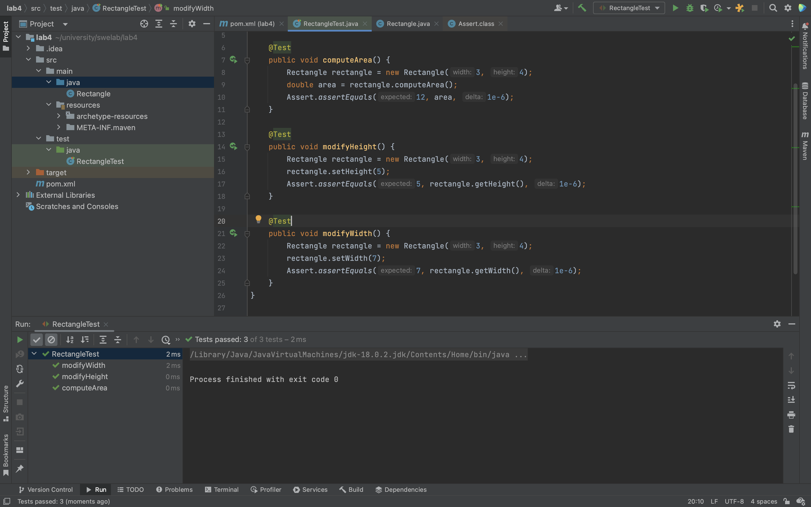

# SWE Lab 4

## Report

### Implement the test for `computeArea`

We face compile error because the Rectangle class is not implemented yet.

### Create the `Rectangle` class

### Run the test for `computeArea`

The test fails because the `computeArea` method is not implemented yet.

### Implement the `computeArea` method

### Run the test for `computeArea`

The test passes.

### Implement the `modifyHeight` and `modifyWidth` tests

We face compile error because the setter and getter methods are not implemented yet.

### Implement the setter and getter methods

### Run the tests for `modifyHeight` and `modifyWidth`

The tests pass.

### Add the `Areaable` interface

### Introduce the `Areaable` interface to the `Rectangle` class

### Implement the test for `Square::computeArea`

We face compile error because the Square class is not implemented yet.

### Create the `Square` class

### Run the test for `Square::computeArea`

The test fails because the `computeArea` method is not implemented yet.

### Implement the `computeArea` method

### Run the test for `Square::computeArea`

The test passes.

### Implement the `Square::modifyWidth` test

We face compile error because the setter method is not implemented yet.

### Implement the setter and getter methods

### Run the test for `Square::modifyWidth`

The test passes.

## Answers to the questions

1. Describe each principle of SOLID in 2 or 3 lines.

    1. Single Responsibility Principle (SRP): A class should have only one reason to change, meaning that it should have only one responsibility.

    1. Open/Closed Principle (OCP): Software entities (classes, modules, functions, etc.) should be open for extension but closed for modification.

    1. Liskov Substitution Principle (LSP): Objects of a superclass should be replaceable with objects of a subclass without affecting the correctness of the program.

    1. Interface Segregation Principle (ISP): Clients should not be forced to depend on interfaces they do not use.

    1. Dependency Inversion Principle (DIP): High-level modules should not depend on low-level modules. Both should depend on abstractions.

1. Which primary steps of software development (requirements analysis, design, implementation, test, and deployment) SOLID principles are used in? explain.

    The SOLID principles can be used in all stages of software development, including requirements analysis, design, implementation, testing, and deployment. However, they are primarily used in the design and implementation stages, as they provide guidance on how to structure the code and organize the components of a software system.

    1. Requirements Analysis: The SOLID principles can help inform the process of requirements analysis by providing guidelines for writing clear, modular, and testable requirements.

    1. Design: During the design phase, the SOLID principles can be used to create a design that follows the principles of good software design. For example, the Single Responsibility Principle (SRP) can be used to ensure that classes and modules have a single, well-defined purpose, and the Dependency Inversion Principle (DIP) can be used to create a flexible and modular design by defining clear abstractions and interfaces.

    1. Implementation: During the implementation phase, the SOLID principles can be used to ensure that the code is organized in a way that makes it easy to maintain and extend. For example, the Open/Closed Principle (OCP) can be used to create extensible code that can be changed without requiring modification of the existing code, and the Liskov Substitution Principle (LSP) can be used to ensure that subclasses can be used in place of their superclasses without causing problems.

    1. Testing: The SOLID principles can also be used in the testing phase to ensure that the code is testable and that tests are organized in a clear and maintainable way.

    1. Deployment: Finally, the SOLID principles can be used during deployment to ensure that the system is deployed in a way that is scalable and maintainable, and that it can be updated and extended over time.

1. Usually, the testing step is performed at the end of software development process, but in TDD, tests are written before implementation. Do these have any paradox? explain.

    There is no paradox between these two approaches.

    In TDD, the tests are written before the implementation to drive the development process and ensure that the code meets the requirements. This approach helps to catch problems early in the development process and to ensure that the code is tested thoroughly. It also helps to create a test suite that can be used to verify the correctness of the code in the future.

    In the traditional approach, testing is performed after the implementation is complete, which means that any problems with the code may not be discovered until later in the development cycle. This can make it more difficult to fix problems and can increase the cost of software development.

1. Assume in the above project, we do not need to modify the rectangle's dimensions. In this case, how would be the models' design?

    In this case, we would not need to implement the setter and getter methods for the `width` and `height` fields. We would also not need to implement the `computeArea` method in this way. Instead, we could have an `area` field that is initialized in the constructor and is not modified after that. This would make the code simpler and easier to maintain.
